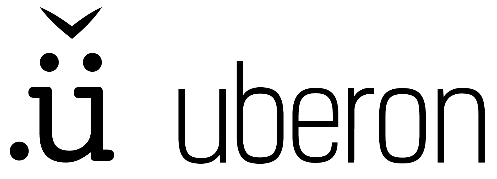
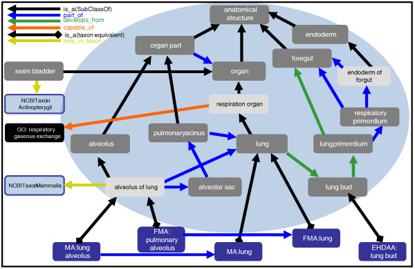

# About UBERON

Uberon is an anatomical ontology that represents body parts, organs and tissues in a variety of animal species, with a focus on vertebrates. It has been constructed to integrate seamlessly with other ontologies, such as the OBO Cell Ontology [workflows](https://obophenotype.github.io/cell-ontology/), the [Gene Ontology](http://geneontology.org/), [Trait and Phenotype ontologies](https://github.com/pato-ontology/pato), as well as other anatomical ontologies.

The ontology includes comprehensive relationships to taxon-specific anatomical ontologies, allowing integration of functional, phenotype and expression data. The figure below shows taxon-centric anatomy ontologies along the bottom axis; domain specific ontologies on the right hand side; orthogonal ontologies on the left axis.

Currently Uberon consists of over 13000 classes representing structures that are shared across a variety of metazoans. As one of the main uses of Uberon is translational science, we have extensive coverage of structures shared between humans and other species. However, thanks to the involvement of many collaborators, we have deep coverage of broad areas of anatomy across diverse taxa.

We also make available an ontology called [composite-metazoan](https://github.com/obophenotype/uberon/wiki/Multi-species-composite-ontologies) which brings in subsets of federated ontologies, with a total of over 40000 classes.