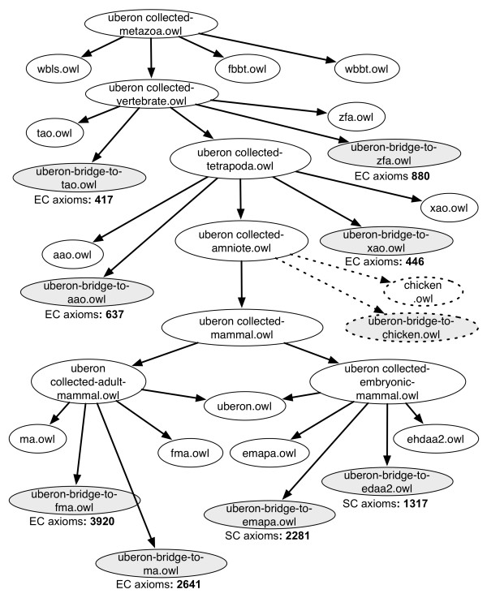

# Combined Multispecies Ontologies

## Composite (merged) Multispecies Ontologies

See the [wiki](https://github.com/obophenotype/uberon/wiki/Multi-species-composite-ontologies) for more details.

Composite ontologies merge species ontologies into the structure of Uberon, merging in taxonomic equivalents, and relabeling species-specific classes. Note the composite ontologies also merge in all of the [Cell Ontology](https://github.com/obophenotype/cell-ontology) (CL).

| name | obo | owl | includes |
| composite-vertebrate | .obo | .owl | MA, EHDAA2, ZFA, XAO, CL |
| composite-metazoan | .obo | .owl | MA, EHDAA2, ZFA, XAO, CL, FBbt, WBbt, PORO, CTENO, CEPH |
| composite-metazoan-basic | .obo | n/a | MA, EHDAA2, ZFA, XAO, CL, FBbt, WBbt, PORO, CTENO, CEPH |

## Importer (collector) Multispecies Ontologies

See the [wiki](https://github.com/obophenotype/uberon/wiki/Multi-species-composite-ontologies) for more details. See also Fig 3 from the Uberon paper: 

The ontology [collected-eukaryote.owl](http://purl.obolibrary.org/obo/uberon/bridge/collected-eukaryote.owl) imports Uberon plus bridging axioms plus individual species anatomy ontologies. The ontology is constructed recursively, and it is possible to obtain an importer ontology for a variety of taxa.
