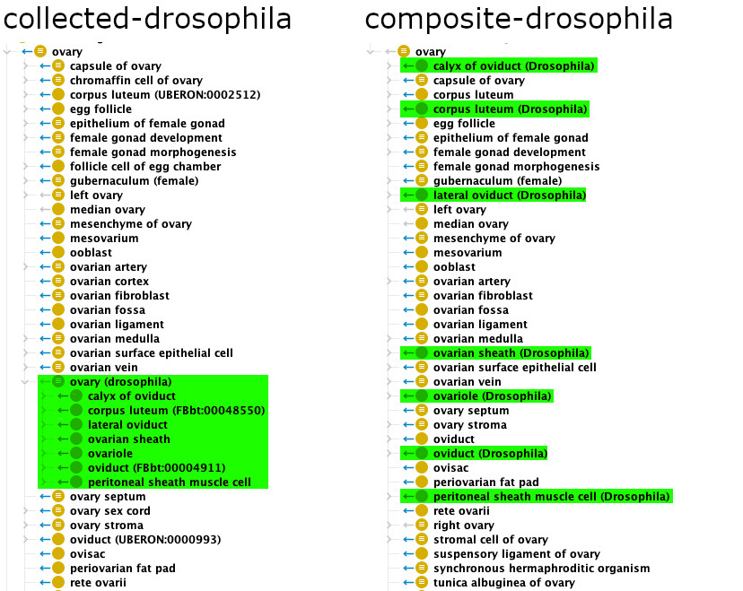

# Combined Multispecies Ontologies

This document describes the multi-species products of Uberon and how
they are built. It is an updated version of the documentation from the
old Uberon Wiki, especially the following pages: [Multi-species importer
ontologies](https://github.com/obophenotype/uberon/wiki/Multi-species-importer-ontologies)
and [Multi-species composite
ontologies](https://github.com/obophenotype/uberon/wiki/Multi-species-composite-ontologies).

## Types of multi-species ontologies.

Uberon provides two distinct types of multi-species products: _collected
ontologies_ and _composite ontologies_.

### Collected ontologies

A _collected ontology_ is obtained by merging Uberon itself, the [Cell
Ontology](https://obophenotype.github.io/cell-ontology/) (CL), one or
several taxon-specific anatomy ontologies, along with, for each
concerned taxon, the corresponding ontology of developmental stages (if
such an ontology exists) and the corresponding [bridge
files](bridges.md).

For example, the `collected-drosophila.owl` ontology is the result of
merging:

* Uberon,
* CL,
* the [Drosophila Anatomy Ontology](https://github.com/FlyBase/drosophila-anatomy-developmental-ontology) (FBbt),
* the [bridge between Uberon and FBbt](https://github.com/obophenotype/uberon/blob/master/src/ontology/bridge/uberon-bridge-to-fbbt.owl),
* the [bridge between CL and FBbt](https://github.com/obophenotype/uberon/blob/master/src/ontology/bridge/cl-bridge-to-fbbt.owl),
* the [Drosophila Developmental Ontology](https://github.com/FlyBase/drosophila-anatomy-developmental-ontology) (FBdv),
* and the [bridge between Uberon and FBdv](https://github.com/obophenotype/uberon/blob/master/src/ontology/bridge/uberon-bridge-to-fbdv.owl).

> Note: Collected ontologies used to be called “importer ontologies”,
> because they were made by using OWL `Import` statements to gather the
> different component ontologies. This no longer reflects how those
> ontologies are built (see further below for some details about the
> pipeline that builds them), so “collected ontologies” is now
> preferred.

#### Available collected ontologies

Uberon defines several collected ontologies for different taxonomic
levels. The custom [Uberon
Makefile](https://github.com/obophenotype/uberon/blob/master/src/ontology/uberon.Makefile),
in its “Composite pipeline” section, is the definitive source of truth
for the various collected ontologies that are available, but as of
January 2025 the list is as follows (for simplicity, bridge files are not
mentioned):

| Product | Components |
| ------- | ---------- |
| collected-drosophila | FBbt + FBdv |
| collected-worm | WBbt + WBls |
| collected-zebrafish | ZFA |
| collected-xenopus | XAO |
| collected-human | EHDAA2 + AEO |
| collected-mouse | EMAPA + MmusDv |
| collected-adult-mammal | MA |
| collected-embryonic-mammal | collected-human + collected-mouse |
| collected-mammal | collected-adult-mammal + collected-embryonic-mammal + DHBA + DMBA + HBA + MBA + PBA |
| collected-anamniote | collected-zebrafish + collected-xenopus |
| collected-amniote | collected-mammal |
| collected-tetrapod | collected-amniote + collected-xenopus |
| collected-vertebrate | collected-tetrapod + collected-zebrafish |
| collected-metazoan | collected-vertebrate + collected-drosophila + collected-worm + CEPH + CTENO + PORO |
| collected-lifestages | Uberon’s life-stages subset + all available species-specific life stages ontologies |

Note that only `collected-metazoan`, `collected-vertebrate`, and
`collected-lifestages` are regularly built and provided as release
artifacts, available through permanent URLs in OBO, OWL, and
Obograph-JSON formats. Other products, if they are needed, must be built
on demand (see further below for instructions on how to do that).

#### Advantages

Collected ontologies

* retain all logical and non-logical axioms of the source ontologies;
  reasoning “just works”;
* allow incorporation at desired level of granularity.

#### Disadvantages

* Collected ontologies are highly latticed and difficult to navigate.
* Differences between a species classand the Uberon parent is often
  trivial or non-existent, resulting in duplicated portions of the
  hierarchy.
* Many tools are not configured to show the “OBO Foundry unique label”
  provided by the bridge files, which means that for example
  `collected-metazoan.owl` will display 10 or so classes with a
  `rdfs:label` of “brain”.

### Composite ontologies

_Composite ontologies_ were designed to address the redundancy problems
inherent with collected ontologies.

#### Principle

A composite ontology is derived from the corresponding collected
ontology (for example, `composite-drosophila` is derived from
`collected-drosophila`). The key part of the process by which a
composite ontology is derived is to replace, whenever possible, the
taxon-specific terms coming from the taxon-specific ontologies by
anonymous class expressions that use the corresponding taxon-neutral
term from Uberon.

For example, let us consider the FBbt term “ovary” (`FBbt:00004865`): it
is mapped to the Uberon term “ovary” (`UBERON:0000992`), which means
that `collected-drosophila` contains the following axiom (provided by the
bridge between Uberon and FBbt):

```
FBbt:00004865 EquivalentTo: UBERON:0000992 and (part_of some NCBITaxon:7227)
```

(`NCBITaxon:7227` being the identifier for the _Drosophila melanogaster_
taxon).

To produce `composite-drosophila`, we remove the `FBbt:00004865` class,
and rewrites all axioms that refer to it to make them use the anonymous
expression the class is equivalent to instead.  So the following axiom,
which states that the “oviduct” (`FBbt:00004911`) is continuous with the
fly ovary:

```
FBbt:00004911 SubClassOf: continuous_with some FBbt:00004865
```

gets rewritten as

```
FBbt:00004911 SubClassOf: continous_with some (UBERON:00009992 and (part_of some NCBITaxon:7227))
```

The figure below illustrates the resulting differences between a
collected ontology and a composite ontology. On the left, the
collected-drosophila ontology contains, below the taxon-neutral “ovary”
(`UBERON:0000992`) term, the fly-specific “ovary” term
(`FBbt:00004865`), to which all terms related to the _Drosophila_ ovary
are attached. On the right, the composite-drosophila no longer contains
the redundant fly-specific “ovary”, and all the fly terms are directly
rattached to the taxon-neutral “ovary”.



#### Available composite ontologies

Because composite ontologies are derived from the collected ontologies,
each collected ontology has a corresponding composite ontology.
Therefore, you may refer to the list of collected ontologies above.

As for the collected ontologies, only `composite-metazoan`,
`composite-vertebrate`, and `composite-lifestages` are built regularly
and provided as pre-built artifacts. Other products, if they are needed,
must be built on demand.

#### Advantages and disadvantages

Compared to collected ontologies, composite ontologies have less
redundancy and are easier to navigate.

However, the absence of some taxon-specific terms (when a taxon-neutral
equivalent is available) may make them unsuitable for data annotation,
unless the taxon information is recorded separately. For example, if you
need to annotate a fly ovary sample, a composite ontology will _not_
contain a term that specifically represents a fly ovary – it will only
contain a term that represents a taxon-neutral ovary, and you will need
another way to record the fact that the sample is coming from a fruit
fly.

## Building the multi-species ontologies

Collected ontologies are simply a merge (performed using ROBOT’s `merge`
command) of the source ontologies.

The only particularity is that the taxon-specific ontologies are _not_
fetched directly from their canonical online locations. Instead, they
are mirrored locally, the mirrors are committed to the repository, and
all subsequent operations are done using the local mirrors. To refresh
the local mirrors, run the following command from the `src/ontology`
directory:

```sh
sh run.sh make MIR=true IMP=true all_local_imports
```

(Alternatively you may also run `sh run.sh make
refresh-external-resources` instead, which will also the mappings and
the bridge files, as well as the normal ODK import modules.)

To build a given collected ontology, simply run:

```sh
sh run.sh make tmp/collected-<name>.owl
```

A composite ontology is built by first building the corresponding
collected ontology, then

* removing all disjointness axioms;
* removing redundant taxon-specific terms as explained above (this is
  done using a [custom ROBOT plugin](https://github.com/gouttegd/uberon-robot-plugin));
* reasoning, relaxing, and reducing.

To build a given composite ontology, simply run:

```sh
sh run.sh make composite-<name>.owl
```

## Adding a species to a collected/composite ontology

(This is _not_ an exhaustive documentation, but intended as a rough
guide for future reference.)

1. Add a “local mirror” for the species-specific ontology to be
   included. Follow the examples of the Makefile rules for the existing
   local mirrors.
2. Ensure that mappings between Uberon/CL terms and the species-specific
   terms are available -- either maintained in Uberon directly, or
   fetched from a remote source (likely the species-specific ontology).
3. Add a [bridge file](bridges.md) (or _several bridges_, if needed) for
   the species-specific ontology.
4. Add the local mirror and any corresponding bridge file to the list of
   source files in the `COLLECTED_xxx_SOURCES` variable (where `xxx` is
   the name of the collected/composite ontology, e.g. `metazoan`).
