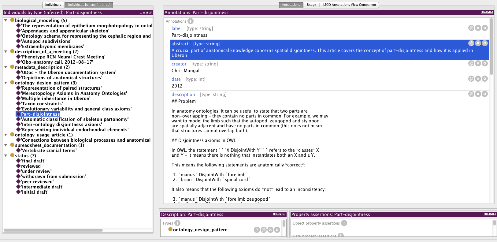

# UDoc - the Uberon documentation system

Permanent URL: [http://purl.obolibrary.org/obo/uberon/references/reference_0000000](http://purl.obolibrary.org/obo/uberon/references/reference_0000000)

Status: [intermediate draft](http://purl.org/spar/pso/intermediate-draft)

Authors and contributors:

 * Chris Mungall (author)

Date: 2012

Document Type: metadata_description

## Summary

This article describes the inline documentation system used by
Uberon. The article is itself a component of the system.

## Background

Documentation is essential for ontology development. yet there is no
standard way to document an ontology. In addition, there is a tendency
for external documentation (wiki pages, web pages, etc) to drift from
the ontology.

## Embedded documentation

This ontology aims to be as self-documenting as possible. In addition
to the standard metadata associated with each class, we embed articles
in the ontology. These articles may describe abstract design patterns
or templates that are repeated throughout the ontology, or the
modeling of a particular piece of biology (e.g. the heart). Some
articles are of interest to users of the ontology, as they describe in
more detail the system being represented and why it was represented in
a particular way. Other articles may be solely for the developers of
the ontology.

## Model

Each article is represented as an individual, and gets a unique
URI. For example, the URI for this article is
(http://purl.obolibrary.org/obo/uberon/references/reference_0000000)[http://purl.obolibrary.org/obo/uberon/references/reference_0000000].

Each article is then adorned with metadata, using properties from
vocabularies such as dublin core. The text of the article is
represented using dc:description with a string value. The text is
authored using a variant of markdown syntax, which can then be
translated to html.

Each article is of a specific type. The categories used include:

 * ontology documentation
  * biological modeling
  * ontology design pattern
  * metadata documentation

Currently the documentation system assumes a flat hierarchy and
assertions to leaf nodes. The vocabulary used for the above is not yet
stable.

Any properties can be used, but the recommended set is:

 * dc:date (1) (currently the year as an int, for historic reasons)
 * dc:creator (1 or more) - the main author(s)
 * dc:contributor (0 or more)
 * dc:title (1, required)
 * dc:abstract (1, required)
 * dc:description (1, required) in markdown format
 * rdfs:seeAlso (0 or more) - links to other related articles or resources

The publishing status ontology (pso) is used to give each article a
status such as 'initial-draft'

## Connecting articles to ontology elements

Each article can be references multiple times in the main ontology, in
different ways.

Sometimes a class may point to an article - for example, if an
ontology class implements a certain design pattern or template
described in an article, then a 'implements design pattern' annotation
property connects the two.

Sometimes it may be more appropriate to link an axiom annotation to an
article.

## Referencing external sources

It is not always appropriate to cram everything into a single article
that is embedded in the ontology. The seeAlso property can be used to
connect out to googledocs, spreadsheets, ontogenesis articles,
textbooks, etc.

## Viewing articles

Articles can be viewed when references.owl is loaded alongside the
main ontology in the ontology editing environment, but this is not
appropriate for everyone.

Each article can be viewed on the web via its purl

## Guidelines for authors

Ontology editors should edit the file references-edit.omn [in
git](https://github.com/cmungall/uberon/tree/master/reference) - any
new articles created should be in their idrange - see
uberonref-idranges.owl.

The file can be edited in a text editor (the recommended text editor
emacs plus Phil Lord's omn-mode.el, plus ubref-helper.el). Note that
the author should be adept in manchester notation.

The prefered route is to open the articles ontology in Protege,
navigating to the 'individuals by type' tab (insert image here).

In both cases, the main text should go in the dc:description tab using
markdown format. Note that hashes should be used for headings rather
than underlines.

The format used is a variant called ontology markdown. Class labels
can be written in backtics - the derived documentation will make PURL
links from these (*to be implemented*).

In general each article type should follow a certain template (to be
documented).

The ontology release manager will generate the derived documentation
from this file.

## Implementation

The current implementation is somewhat ad-hoc and may be replaced.

The references-edit.omn is translated to an rdf/owl ontology -
[references.owl](http://purl.obolibrary.org/obo/uberon/references.owl)

A perl script (owldoc2md.pl) generates individual markdown (.md) files
from this owl file (using a to-be-released API). It assumes some of
the annotation properties listed above are used.

Each markdown file is then converted to an html file using pandoc.

The html file has the same name as the localname of the URI. It is
committed to svn, and the svn property svn:mime-type is set to
text/html

## Acknowledgments

This system was inspired by Matt Brush's REO documentation system
developed at OHSU, and by David Osumi-Sutherland's org-mode system, as
well as by Phil Lord's articles on ontology documentation and applying
literate programming ideas to ontologies.

